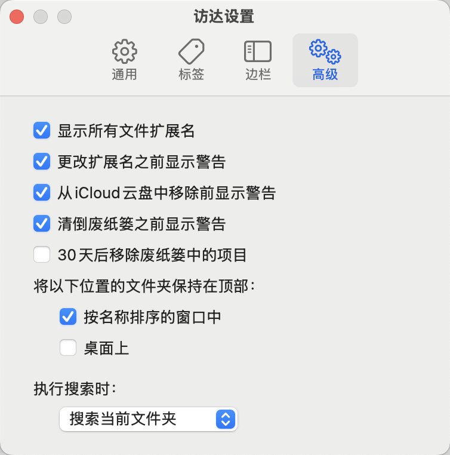
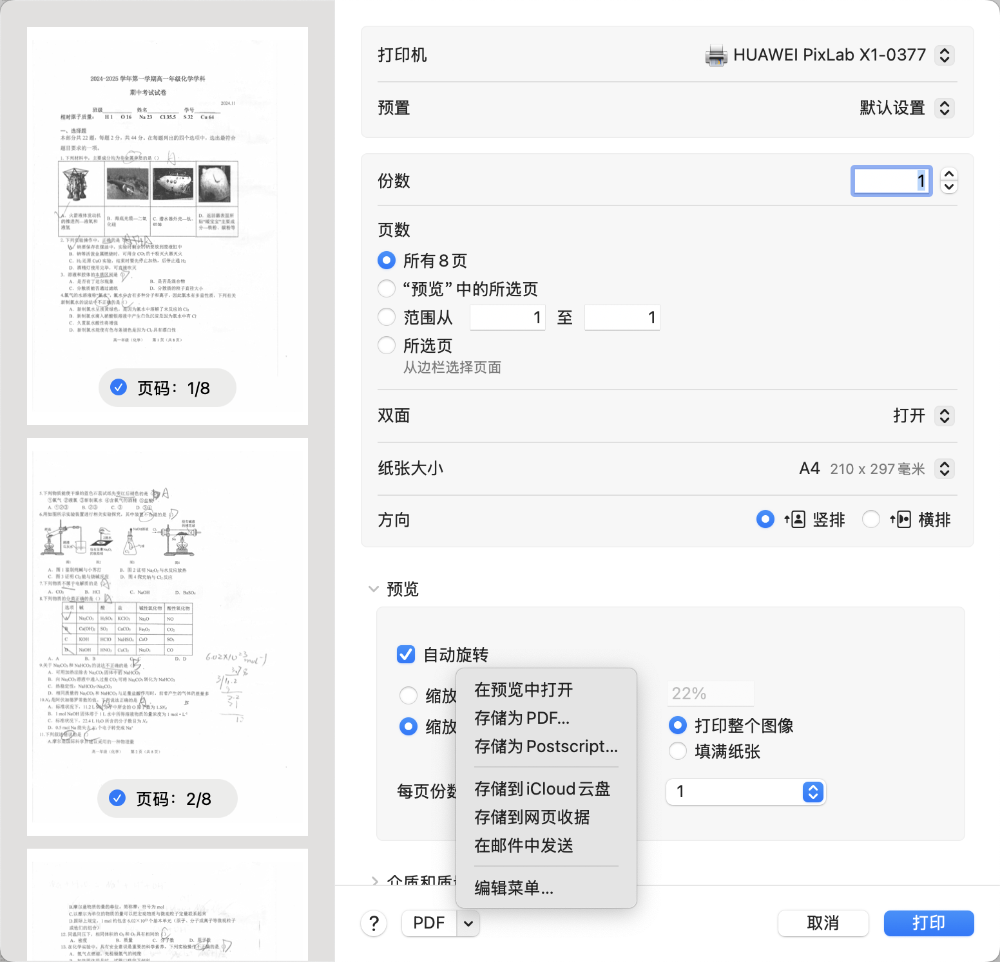

# MacOS

## How to

### 在访达中显示文件扩展名

`访达 > 设置 > 高级 > 显示所有文件扩展名`

### 将窗口移到屏幕一侧
按住 Option 键并将指针移到窗口左上角的绿色按钮上方，然后从出现的菜单中选取“将窗口移到屏幕左侧”或“将窗口移到屏幕右侧”。窗口会填充左半侧或右半侧屏幕，菜单栏和程序坞仍会显示。
More details in [在 Mac 上管理 App 窗口](https://support.apple.com/zh-cn/guide/mac-help/mchlp2469/mac)

### 忘记iPhone密码

[如果你忘记了 iPhone 密码 - 官方 Apple 支持 (中国)](https://support.apple.com/zh-cn/HT204306)

### 多张图片组成PDF文件

1. 在"访达"中选择多张图片
2. Command+下箭头打开“预览”app
3. Command+P 进入打印窗口
4. 选择 PDF 下拉菜单
5. 选择“存储为PDF”

## Reference
[在 Mac 上管理 App 窗口](https://support.apple.com/zh-cn/guide/mac-help/mchlp2469/mac)

