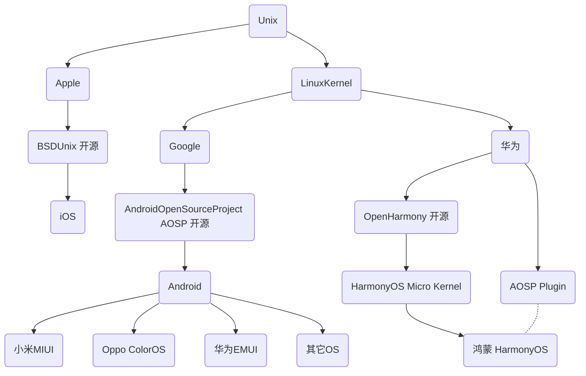

# Mobile OS

```mermaid
graph TB
	Unix(Unix) --> Linux(LinuxKernel)
	
	Unix --> Apple(Apple)
	Apple --> BSD(BSDUnix 开源)
	BSD --> iOS(iOS)
	
	Linux --> Google(Google)
	Google --> AOSP(AndroidOpenSourceProject AOSP 开源)
	AOSP --> Android(Android)
	Android --> MIUI(小米MIUI)
	Android --> ColorOS(Oppo ColorOS)
	Android --> EMUI(华为EMUI)
	Android --> Others(其它OS)

	Linux --> Huawei(华为)
	Huawei --> OpenHarmony(OpenHarmony 开源)
	Huawei --> AOSPPlugin(AOSP Plugin)
	OpenHarmony --> HarmonyMicro(HarmonyOS Micro Kernel)
	HarmonyMicro --> HarmonyOS(鸿蒙 HarmonyOS)
	AOSPPlugin -.- HarmonyOS
```

